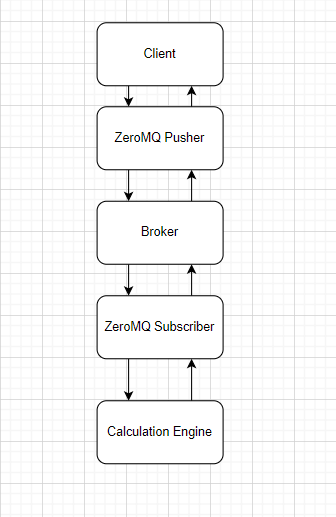
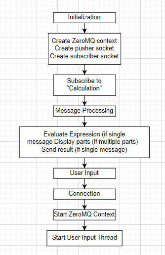

# ZeroMQ Client-Broker Communication System
This repository contains code for a client-broker communication system using ZeroMQ.
## Overview
The system consists of a client and a broker that communicate via ZeroMQ sockets. The client sends messages to the broker, and the broker processes these messages and sends back the results or other messages to the client.
## Prerequisites

- C++ compiler
- ZeroMQ library
- 
## Installation

1. Clone the repository:

   ```bash
   git clone https://github.com/ferrecream/ZMQ_Netwerk.git

2. Install the required dependencies.
3. Build the project using your preferred build system.

## Communication Flow
1. Initialization
   - The program initializes a ZeroMQ context.
   - It creates two sockets: one for pushing messages (pusher) and one for subscribing to messages (subscriber).
   - The subscriber socket subscribes to messages with the topic "Calculation".
3. Message Processing
- When a message is received on the subscriber socket:
   - If the message contains a single expression:
      - The expression is evaluated using the evaluateExpression function.
      - The result is sent back using the pusher socket.
   - If the message contains multiple parts:
      - Each part of the message is displayed.
3. User Input
   - A separate thread is created to handle user input.
   - When a line of input is received from the user:
      - The input is sent as a message using the pusher socket.
6. Connection
   - The pusher and subscriber sockets connect to the specified server addresses.
   - If the connection fails, an error message is displayed.
     


the working of the code itself



# Usage
1. Compile the Code: Compile the provided C++ code using your C++ compiler.
    ```bash
    g++ -o calculator_service calculator_service.cpp -lzmq
    
2. Run the Service: Execute the compiled binary to start the calculator service.
   ```bash
   ./calculator_service
   
3. Send Messages: Send messages to the calculator service in the following format:
   ```bash
   Calculator>[operation]>[operand1]>[operand2]

Replace `[operation]` with the desired arithmetic operation (`add`, `subtract`, `multiply`, or `divide`), `[operand1]` with the first operand, and `[operand2]` with the   second operand.Example:To perform a division operation with operands 20 and 4:

      Calculator>divide>20>4
   
4. Receive Results: The service will perform the requested operation and send back the result.
